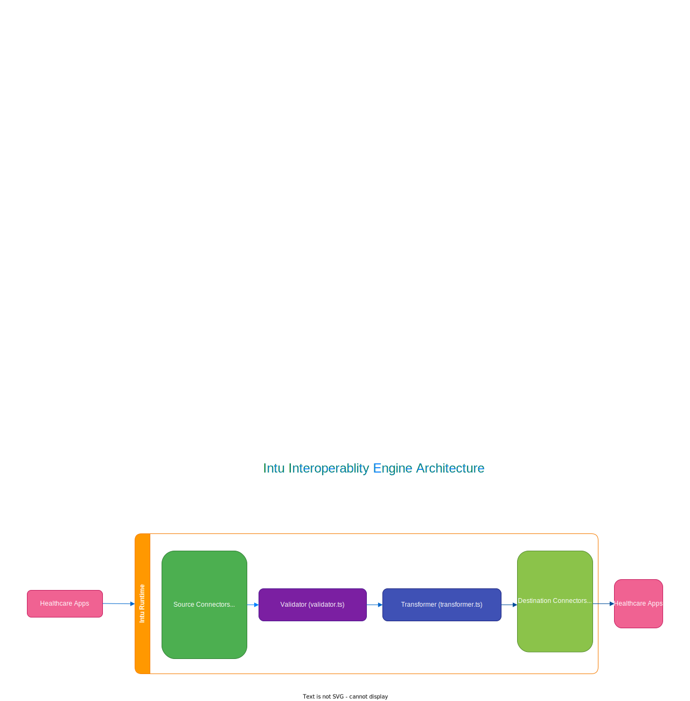

# intu

`intu` is a Git-native, AI-friendly healthcare interoperability framework that lets teams build, version, and deploy integration pipelines using YAML configuration and TypeScript transformers.

## Features

- Go-based CLI and runtime engine.
- `intu init <project-name>` to bootstrap a project.
- `intu c <channel-name>` / `intu channel add <channel-name>` to add channels.
- Root-level named destinations; channels reference by name; multi-destination support.
- YAML configuration with profile layering (`intu.yaml`, `intu.dev.yaml`, `intu.prod.yaml`).
- Pure TypeScript transformers and validators (JSON in, JSON out).
- Full pipeline: preprocessor, validator, source filter, transformer, destination filter/transformer, response transformer, postprocessor.
- 12 source connector types and 13 destination connector types.
- Healthcare protocol support: HL7v2, FHIR R4, X12, CCDA, DICOM.
- Retry with configurable backoff, dead-letter queue, destination queuing.
- Message storage, metrics, alerting, and batch processing.
- Map variables (globalMap, channelMap, responseMap, connectorMap) for sharing data across pipeline stages.
- Code template libraries for reusing logic across channels.
- Channel import/export, cloning, and dependency ordering.
- Message browser for searching and inspecting processed messages.
- Web dashboard for monitoring channels and metrics.

## Architecture

High-level architecture of an `intu` deployment:



## Install

**Via npm (recommended):**

```bash
npm i -g intu-dev
```

**From source:**

```bash
go mod tidy
go build -o intu .
# or: go run . init ...
```

## Quick Start

```bash
intu init my-project
cd my-project
npm run dev
```

`intu init` scaffolds the project and runs `npm install` automatically. `npm run dev` starts the engine (which auto-compiles TypeScript).

Add a new channel:

```bash
intu c my-channel --dir .
# or
intu channel add my-channel --dir .
```

## CLI Commands

All commands accept the global flag `--log-level (debug|info|warn|error)` (default: `info`).

### Project & Build

| Command | Description |
|---------|-------------|
| `intu init <project-name> [--dir] [--force]` | Bootstrap a new project and install dependencies |
| `intu validate [--dir] [--profile]` | Validate project configuration and channel layout |
| `intu build [--dir]` | Compile TypeScript transformers (optional — `intu serve` auto-compiles) |
| `intu serve [--dir] [--profile]` | Start the runtime engine and process messages for all enabled channels |

### Channel Management

| Command | Description |
|---------|-------------|
| `intu c <channel-name> [--dir] [--force]` | Shorthand to scaffold a new channel in an existing project |
| `intu channel add <channel-name> [--dir] [--force]` | Add a new channel via the `channel` subcommand |
| `intu channel list [--dir] [--profile] [--tag] [--group]` | List channels with optional tag/group filters |
| `intu channel describe <id> [--dir] [--profile]` | Show the raw `channel.yaml` for a channel |
| `intu channel clone <source> <new> [--dir]` | Clone a channel to create a new one with a different ID |
| `intu channel export <id> [--dir] [-o file]` | Export a channel as a portable `.tar.gz` archive |
| `intu channel import <archive> [--dir] [--force]` | Import a channel from a `.tar.gz` archive |

### Deployment & Operations

| Command | Description |
|---------|-------------|
| `intu deploy [channel-id] [--dir] [--profile] [--all] [--tag]` | Mark channels as `enabled` (deploy) |
| `intu undeploy <channel-id> [--dir] [--profile]` | Mark a channel as `disabled` (undeploy) |
| `intu enable <channel-id> [--dir] [--profile]` | Enable a channel (alias for `deploy` on a single channel) |
| `intu disable <channel-id> [--dir] [--profile]` | Disable a channel (alias for `undeploy`) |
| `intu stats [channel-id] [--dir] [--profile] [--json]` | Show channel statistics with live metrics |
| `intu prune [--dir] [--channel\|--all] [--before] [--dry-run] [--confirm]` | Prune stored message data |

### Message Browser

| Command | Description |
|---------|-------------|
| `intu message list [--channel] [--status] [--since] [--before] [--limit] [--json]` | List messages from the store with filters |
| `intu message get <message-id> [--json]` | Get a specific message by ID |
| `intu message count [--channel] [--status]` | Count messages in the store |

### Advanced

| Command | Description |
|---------|-------------|
| `intu dashboard [--dir] [--profile] [--port]` | Launch the dashboard standalone (included in `intu serve` by default) |

## Bootstrapped Structure

```text
.
├── intu.yaml           # Root config + named destinations
├── intu.dev.yaml
├── intu.prod.yaml
├── .env
├── channels/
│   └── sample-channel/
│       ├── channel.yaml
│       ├── transformer.ts
│       └── validator.ts
├── lib/
│   └── index.ts        # Shared utilities
├── package.json
├── tsconfig.json
└── README.md
```

## Destinations

Define named destinations in `intu.yaml`:

```yaml
destinations:
  kafka-output:
    type: kafka
    kafka:
      brokers: [${INTU_KAFKA_BROKER}]
      topic: output-topic
    retry:
      max_attempts: 3
      backoff: exponential
      initial_delay_ms: 500
```

Channels reference them (multi-destination):

```yaml
destinations:
  - kafka-output
  - name: audit-http
    type: http
    http:
      url: https://audit.example.com/events
```

## Sources & Destinations

All listed connectors are **fully implemented** in the current runtime.

### Supported Sources (Listeners)

| Type | Config Key | Description |
|------|-----------|-------------|
| HTTP | `listener.type: http` | JSON/REST listener with path, methods, TLS, and auth (bearer, basic, api_key, mTLS) |
| TCP/MLLP | `listener.type: tcp` | Raw TCP or MLLP mode for HL7 over TCP, with TLS and ACK/NACK |
| File | `listener.type: file` | Local filesystem poller with glob patterns, move/error dirs |
| Kafka | `listener.type: kafka` | Kafka consumer with TLS, SASL auth |
| Database | `listener.type: database` | SQL polling reader for Postgres, MySQL, MSSQL, SQLite |
| SFTP | `listener.type: sftp` | SFTP poller with password/key auth |
| Channel | `listener.type: channel` | In-memory channel-to-channel bridge |
| Email | `listener.type: email` | IMAP/POP3 reader with TLS |
| DICOM | `listener.type: dicom` | DICOM SCP with AE title validation and TLS |
| SOAP | `listener.type: soap` | SOAP/WSDL listener with TLS and auth |
| FHIR | `listener.type: fhir` | FHIR R4 server with capability statement and subscriptions |
| IHE | `listener.type: ihe` | IHE profiles: XDS Repository/Registry, PIX, PDQ |

### Supported Destinations

| Type | Config Key | Description |
|------|-----------|-------------|
| HTTP | `type: http` | HTTP sender with headers, auth (bearer, basic, api_key, OAuth2), TLS |
| Kafka | `type: kafka` | Kafka producer with TLS and SASL auth |
| TCP/MLLP | `type: tcp` | TCP sender with MLLP support and TLS |
| File | `type: file` | Filesystem writer with templated filenames |
| Database | `type: database` | SQL writer with parameterized statements |
| SFTP | `type: sftp` | SFTP file writer with auth |
| SMTP | `type: smtp` | Email sender with TLS and STARTTLS |
| Channel | `type: channel` | In-memory channel-to-channel routing |
| DICOM | `type: dicom` | DICOM SCU sender with TLS |
| JMS | `type: jms` | JMS via HTTP REST (ActiveMQ, etc.) |
| FHIR | `type: fhir` | FHIR R4 client for create/update/transaction |
| Direct | `type: direct` | Direct messaging protocol for HIE |
| Log | `type: log` | Structured logging destination |

## Data Types

| Type | Description |
|------|-------------|
| `raw` | Pass-through |
| `json` | JSON parse/serialize |
| `xml` | XML DOM parse/serialize |
| `csv` / `delimited` | Column-based parse/serialize |
| `hl7v2` | HL7 v2.x segment/field/component parsing |
| `hl7v3` / `ccda` | CDA/CCDA XML parsing |
| `fhir_r4` | FHIR R4 JSON parsing |
| `x12` | X12 EDI segment parsing |
| `binary` | Base64 encode/decode |

## Pipeline Stages

Each channel processes messages through a configurable pipeline:

```
Source → Preprocessor → Validator → Source Filter → Transformer
  → Destination Filter → Destination Transformer → Send
  → Response Transformer → Postprocessor
```

All stages except the transformer are optional. Per-destination filters and transformers allow customizing the payload for each destination independently.

## Contributing

Contributions (bug reports, docs, and code) are very welcome.

- **Issues & PRs**: Open them on the GitHub repository.
- **Maintainer contact**: `ramnish@intuware.com`

If you are proposing a larger feature, please skim the [ROADMAP](ROADMAP.md) first so we can keep the design aligned.

## License

`intu` is licensed under the **Mozilla Public License 2.0 (MPL-2.0)**.  
See the [`LICENSE`](LICENSE) file for the full text and details about copyleft scope.
